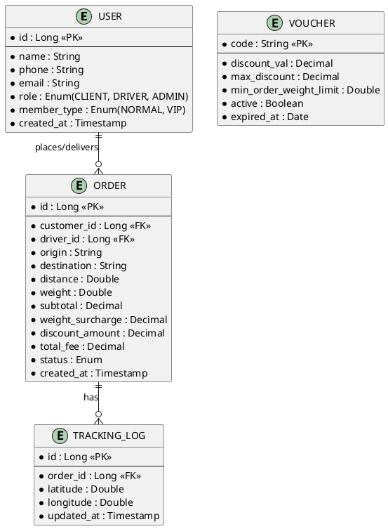

HACKATHON AI APPLICATION IN ACTION - ĐỀ 001

* Họ và tên: Trần Minh Đức
* Mã học viên: PTIT-HCM-085
* Lớp: HCM-K24-CNTT1
* Mã đề: 001

---

MỤC TIÊU KỸ THUẬT

Để giải quyết triệt để các vấn đề của hệ thống cũ và đáp ứng yêu cầu mở rộng linh hoạt, dự án áp dụng các giải pháp công nghệ và kiến trúc sau:

1. Tái cấu trúc OrderService (Phần 1):
   - Strategy Pattern (Mẫu chiến lược): Áp dụng để cô lập các thuật toán tính toán giảm giá (VoucherStrategy) và các cổng thanh toán (PaymentStrategy). Khi thêm mã giảm giá hoặc cổng thanh toán mới, chỉ cần tạo thêm class mới hiện thực interface tương ứng mà không làm ảnh hưởng đến hàm checkout chính.
   - Dependency Injection (DI) & Factory/Registry Pattern: Sử dụng cơ chế tự động quét các Strategy class của Spring Boot và quản lý chúng qua một Registry Map.
   - Observer/Service Pattern (NotificationService): Trích xuất logic gửi thông báo ra khỏi OrderService thành một dịch vụ riêng biệt. Việc đổi kênh gửi (Email sang SMS/Zalo) sẽ được cấu hình động thông qua cấu hình hoặc inject Strategy tương ứng.
2. Sửa lỗi JwtAuthenticationFilter (Phần 2):
   - Exception Translation Pattern: Khi ngoại lệ ExpiredJwtException xảy ra tại Filter chain (nằm ngoài phạm vi quản lý của DispatcherServlet), Spring Security sẽ crash và trả về lỗi 500. Giải pháp là chuyển tiếp ngoại lệ này sang HandlerExceptionResolver của Spring để chuyển tiếp nó đến @ControllerAdvice toàn cục.
   - Unified API Response format: Trả về mã lỗi HTTP 401 Unauthorized cùng một định dạng JSON đồng nhất dạng {"error": "AUTH_FAILED", "message": "..."} thay vì in ra stack trace lỗi thô.
3. Phân tích hệ thống Rikkei Logistics (Phần 3):
   - Backend: Spring Boot (Java 17) + Spring Data JPA + PostgreSQL (đảm bảo tính toàn vẹn giao dịch ACID).
   - Mobile App: Flutter (Cross-platform cho tài xế và khách hàng, tối ưu chi phí).
   - Web Admin: ReactJS (Single Page Application tối ưu cho nhân viên điều phối).
   - Real-time Tracking: WebSocket API / Firebase Realtime Database.
   - Thiết kế CSDL: Chuẩn hóa quan hệ ERD bằng mã Mermaid.

---

LỊCH SỬ PROMPT (PROMPT CHAIN)

PHẦN 1: TÁI CẤU TRÚC HỆ THỐNG
* Vòng 1 (Khởi tạo & Phân tích kiến trúc):
    [ROLE]
    Act as a Senior Java Developer and Software Architect.
    
    [CONTEXT & TASK]
    I have an existing `OrderService` class handling checkouts that severely violates the Open/Closed Principle (OCP) and the Single Responsibility Principle (SRP). The discount calculation logic, payment methods, and notification channels are all hardcoded inside the checkout method.
    Here is the current source code:
    [Paste original OrderService code]

    [REQUIREMENTS]
    Analyze the source code above and propose a refactoring plan using design patterns:
    1. Strategy Pattern for discount logic (Vouchers) and payment methods (Payments).
    2. Extract notification logic into a separate dedicated service.
    Explain the architectural design details before writing code.

    [OUTPUT FORMAT]
    Architectural analysis and class structure diagrams of the new design.

    [VERIFICATION]
    Ensure that in the future, the checkout method does not need to be modified when adding new vouchers or payment methods.

* Vòng 2 (Sinh code các Interface & Strategy con):
    [ROLE]
    Act as a Senior Java Developer.

    [CONTEXT & TASK]
    Based on the architecture proposed in Round 1, I need the concrete class implementations and interfaces for the new payment and discount system.

    [REQUIREMENTS]
    1. Define the interfaces: `VoucherStrategy`, `PaymentStrategy`, and `NotificationService`.
    2. Implement concrete Vouchers: `VipVoucherStrategy` (20% discount) and `FreeshipVoucherStrategy` (deducts 30,000 VND).
    3. Implement concrete Payments: `MomoPaymentStrategy` and `VnPayPaymentStrategy`.
    4. Implement `EmailNotificationService` and `SmsNotificationService`.
    5. Ensure all classes are registered as Spring beans using `@Component`.

    [OUTPUT FORMAT]
    Complete Java 17 source code for the interfaces and implementing classes.

    [VERIFICATION]
    Ensure all classes follow clean coding conventions and are fully extensible.

* Vòng 3 (Tích hợp và Cấu hình tự động):
    [ROLE]
    Act as a Senior Java Developer.

    [CONTEXT & TASK]
    I need to complete the new `OrderService` class and implement a mechanism to automatically lookup the appropriate strategy based on the voucher code and payment method passed from the controller, without manually using the `new` keyword.

    [REQUIREMENTS]
    1. Write the complete `OrderService` class injecting the list/map of `VoucherStrategy` and `PaymentStrategy` beans automatically via Spring.
    2. Implement the core `checkout` method using the injected strategies to calculate the final price, process the payment, and send notifications.
    3. Ensure safe exception handling if the payment method is unsupported or the user is locked.

    [OUTPUT FORMAT]
    Complete Java 17 source code for the refactored `OrderService`.

    [VERIFICATION]
    Verify that adding a new payment method (e.g., ZaloPay) only requires creating a new `@Component` class without changing any existing code in `OrderService`.

PHẦN 2: DEBUGGING SECURITY & XỬ LÝ LỖI HỆ THỐNG
* Vòng 1 (Phân tích lỗi gốc):
    [ROLE]
    Act as a Spring Security Architect.

    [CONTEXT & TASK]
    My Spring Boot Security application crashes with a 500 Internal Server Error when a client sends an expired JWT token, throwing `ExpiredJwtException`.
    Here is the current filter code:
    [Paste original JwtAuthenticationFilter code]
    Here is the server error log:
    [Paste ExpiredJwtException log]

    [REQUIREMENTS]
    1. Explain the root cause of why this exception thrown in the filter chain bypasses the standard `@ControllerAdvice` and returns a 500 error instead of a 401.
    2. Propose the most clean and robust architectural solution to resolve this.

    [OUTPUT FORMAT]
    Technical explanation and proposed solution options.

* Vòng 2 (Sinh code sửa đổi):
    [ROLE]
    Act as a Spring Security Expert.

    [CONTEXT & TASK]
    I have chosen the solution to catch the exception in the filter and forward it to Spring's `HandlerExceptionResolver` so it can be handled globally by `@ControllerAdvice`.

    [REQUIREMENTS]
    1. Modify `JwtAuthenticationFilter` to catch `ExpiredJwtException` and forward it via `HandlerExceptionResolver`.
    2. Write a `@RestControllerAdvice` class that catches this exception and returns a unified JSON format: `{"error": "AUTH_FAILED", "message": "..."}`.
    3. Explain why this approach is superior to using a simple try-catch block and writing directly to the `HttpServletResponse` within the filter.

    [OUTPUT FORMAT]
    Complete Java 17 code for the modified filter and the exception handler.

---

PHÂN TÍCH LỖI AI & CÁCH KHẮC PHỤC

* Điểm chưa tối ưu ở lần sinh code đầu tiên của AI:
  Ở phần tái cấu trúc mã nguồn (Phần 1), trong lần sinh code đầu tiên, AI đã tự động sử dụng @Autowired để tiêm trực tiếp các class cụ thể như MomoPayment và VnPayPayment vào trong OrderService. Đồng thời, AI viết một loạt các câu lệnh if-else trong hàm checkout để kiểm tra phương thức thanh toán nào được gọi.
* Hệ quả:
  Cách làm này hoàn toàn thất bại vì nó vẫn vi phạm nguyên lý Open/Closed Principle (OCP). Khi muốn thêm cổng thanh toán ZaloPay, lập trình viên vẫn phải sửa code OrderService để @Autowired thêm bean mới và bổ sung thêm nhánh else if.
* Cách khắc phục của sinh viên:
  Em đã gửi tiếp Prompt Vòng 3 yêu cầu AI chuyển sang cơ chế Dependency Injection danh sách (Map hoặc List):
  private final Map<String, PaymentStrategy> paymentStrategies;
  Spring Boot sẽ tự động quét toàn bộ các Bean implement PaymentStrategy và đưa vào Map. Hàm checkout chỉ cần lấy ra theo tên phương thức (paymentStrategies.get(paymentMethod)). Nhờ đó, việc thêm mới cổng thanh toán sau này chỉ cần tạo thêm class @Component mới mà hoàn toàn không cần sửa đổi OrderService.

---

PHẦN 1: MÃ NGUỒN TÁI CẤU TRÚC (REFACTORING)

1. File: VoucherStrategy.java

package com.rikkei.refactoring.strategy;

public interface VoucherStrategy {
    boolean isApplicable(String voucherCode);
    double applyDiscount(double total);
}

2. File: VipVoucherStrategy.java

package com.rikkei.refactoring.strategy;
import org.springframework.stereotype.Component;

@Component
public class VipVoucherStrategy implements VoucherStrategy {
    @Override
    public boolean isApplicable(String voucherCode) {
        return voucherCode != null && voucherCode.startsWith("VIP");
    }

    @Override
    public double applyDiscount(double total) {
        return total * 0.8; // Giảm 20%
    }
}

3. File: FreeshipVoucherStrategy.java

package com.rikkei.refactoring.strategy;
import org.springframework.stereotype.Component;

@Component
public class FreeshipVoucherStrategy implements VoucherStrategy {
    @Override
    public boolean isApplicable(String voucherCode) {
        return voucherCode != null && voucherCode.startsWith("FREESHIP");
    }

    @Override
    public double applyDiscount(double total) {
        return Math.max(0, total - 30000); // Trực tiếp trừ 30k, tối thiểu bằng 0
    }
}

4. File: PaymentStrategy.java

package com.rikkei.refactoring.strategy;

public interface PaymentStrategy {
    String getMethodName();
    void processPayment(double amount);
}

5. File: MomoPaymentStrategy.java

package com.rikkei.refactoring.strategy;
import org.springframework.stereotype.Component;

@Component
public class MomoPaymentStrategy implements PaymentStrategy {
    @Override
    public String getMethodName() {
        return "MOMO";
    }

    @Override
    public void processPayment(double amount) {
        System.out.println("Connecting to Momo API to pay amount: " + amount);
    }
}

6. File: VnPayPaymentStrategy.java

package com.rikkei.refactoring.strategy;
import org.springframework.stereotype.Component;

@Component
public class VnPayPaymentStrategy implements PaymentStrategy {
    @Override
    public String getMethodName() {
        return "VNPAY";
    }

    @Override
    public void processPayment(double amount) {
        System.out.println("Connecting to VNPay API to pay amount: " + amount);
    }
}

7. File: NotificationService.java

package com.rikkei.refactoring.notification;
import com.rikkei.refactoring.model.User;

public interface NotificationService {
    void sendNotification(User user, String message);
}

8. File: EmailNotificationService.java

package com.rikkei.refactoring.notification;
import com.rikkei.refactoring.model.User;
import org.springframework.stereotype.Service;

@Service
public class EmailNotificationService implements NotificationService {
    @Override
    public void sendNotification(User user, String message) {
        System.out.println("Sending email to " + user.getEmail() + " details: " + message);
    }
}

9. File: SmsNotificationService.java

package com.rikkei.refactoring.notification;
import com.rikkei.refactoring.model.User;
import org.springframework.stereotype.Service;

@Service
public class SmsNotificationService implements NotificationService {
    @Override
    public void sendNotification(User user, String message) {
        System.out.println("Sending SMS to " + user.getEmail() + " details: " + message);
    }
}

10. File: OrderService.java

package com.rikkei.refactoring.service;

import com.rikkei.refactoring.model.*;
import com.rikkei.refactoring.strategy.*;
import com.rikkei.refactoring.notification.NotificationService;
import org.springframework.stereotype.Service;

import java.util.List;
import java.util.Map;
import java.util.function.Function;
import java.util.stream.Collectors;

@Service
public class OrderService {

    private final List<VoucherStrategy> voucherStrategies;
    private final Map<String, PaymentStrategy> paymentStrategies;
    private final NotificationService notificationService; // Tiêm kênh thông báo mặc định

    // Spring tự động tiêm tất cả các Strategy đã đăng ký dưới dạng Component
    public OrderService(List<VoucherStrategy> voucherStrategies,
                        List<PaymentStrategy> paymentStrategies,
                        NotificationService notificationService) {
        this.voucherStrategies = voucherStrategies;
        this.paymentStrategies = paymentStrategies.stream()
                .collect(Collectors.toMap(PaymentStrategy::getMethodName, Function.identity()));
        this.notificationService = notificationService;
    }

    public Order checkout(Cart cart, User user, String paymentMethod, String voucherCode) {
        // 1. Kiểm tra trạng thái User
        if (user.getStatus() != 1) {
            throw new RuntimeException("User locked");
        }

        // 2. Tính tiền gốc của giỏ hàng
        double total = cart.getItems().stream()
                .mapToDouble(item -> item.getPrice() * item.getQuantity())
                .sum();

        // 3. Áp dụng mã giảm giá động thông qua Voucher Strategies
        if (voucherCode != null) {
            for (VoucherStrategy strategy : voucherStrategies) {
                if (strategy.isApplicable(voucherCode)) {
                    total = strategy.applyDiscount(total);
                    break; // Ưu tiên áp dụng mã khớp đầu tiên
                }
            }
        }

        // 4. Xử lý thanh toán động thông qua Payment Strategies Map
        PaymentStrategy paymentStrategy = paymentStrategies.get(paymentMethod);
        if (paymentStrategy == null) {
            throw new RuntimeException("Payment not supported: " + paymentMethod);
        }
        paymentStrategy.processPayment(total);

        // 5. Gửi thông báo thông qua dịch vụ thông báo độc lập
        String message = "Your order details. Total payment amount: " + total;
        notificationService.sendNotification(user, message);

        return new Order(user, total, "SUCCESS");
    }
}

---

PHẦN 2: DEBUGGING SECURITY & XỬ LÝ LỖI HỆ THỐNG

1. Phân tích nguyên nhân gốc rễ (Root Cause)
* Ngoại lệ ExpiredJwtException được ném ra từ thư viện JSON Web Token bên trong bộ lọc JwtAuthenticationFilter.doFilterInternal().
* Vì Filter Chain của Spring Security chạy ở tầng Servlet Container, trước khi yêu cầu đi vào DispatcherServlet (nơi quản lý các Controller), mọi lỗi quăng ra tại tầng Filter Chain sẽ vượt qua tầm kiểm soát của @ControllerAdvice và @ExceptionHandler thông thường.
* Khi có lỗi không được bắt ở Filter, Servlet Container của Web Server (như Tomcat) sẽ tự động bắt lấy lỗi này và hiển thị trang lỗi 500 mặc định của hệ thống.

2. Tại sao không nên dùng try-catch và viết trực tiếp vào Response ở Filter?
* Vi phạm kiến trúc phân tầng (Separation of Concerns): Việc viết JSON phản hồi trực tiếp bằng response.getWriter().write(...) làm rối code Filter. Filter chỉ nên thực hiện xác thực hoặc chuyển hướng luồng.
* Lặp code (Duplicated Code): Nếu hệ thống có nhiều bộ lọc bảo mật khác nhau (API Key, OAuth2, v.v.), ta phải viết lại khối xử lý ghi đè response ở nhiều nơi.
* Khó duy trì và quốc tế hóa: Không thể tận dụng được các cơ chế chuẩn của Spring Boot như xử lý đa ngôn ngữ (Localization), ghi cấu hình mã lỗi (Response format) tập trung tại một nơi.

3. File sửa đổi: JwtAuthenticationFilter.java

package com.rikkei.security;

import io.jsonwebtoken.ExpiredJwtException;
import io.jsonwebtoken.Jwts;
import jakarta.servlet.FilterChain;
import jakarta.servlet.ServletException;
import jakarta.servlet.http.HttpServletRequest;
import jakarta.servlet.http.HttpServletResponse;
import org.springframework.beans.factory.annotation.Autowired;
import org.springframework.beans.factory.annotation.Qualifier;
import org.springframework.security.core.context.SecurityContextHolder;
import org.springframework.web.filter.OncePerRequestFilter;
import org.springframework.web.servlet.HandlerExceptionResolver;

import java.io.IOException;

public class JwtAuthenticationFilter extends OncePerRequestFilter {

    private final String SECRET_KEY = "rikkei_secret_key_super_secure_do_not_share";

    // Tiêm HandlerExceptionResolver của Spring để chuyển tiếp ngoại lệ đến ControllerAdvice
    @Autowired
    @Qualifier("handlerExceptionResolver")
    private HandlerExceptionResolver resolver;

    @Override
    protected void doFilterInternal(HttpServletRequest request,
                                    HttpServletResponse response, 
                                    FilterChain filterChain) throws ServletException, IOException {
        String authHeader = request.getHeader("Authorization");
        try {
            if (authHeader != null && authHeader.startsWith("Bearer ")) {
                String token = authHeader.substring(7);
                String username = Jwts.parser()
                        .setSigningKey(SECRET_KEY)
                        .parseClaimsJws(token)
                        .getBody()
                        .getSubject();

                if (username != null && SecurityContextHolder.getContext().getAuthentication() == null) {
                    // Logic set Authentication vào SecurityContext (đã rút gọn)
                }
            }
            filterChain.doFilter(request, response);
        } catch (ExpiredJwtException e) {
            // Chuyển tiếp exception sang resolver để ControllerAdvice bắt lỗi tập trung
            resolver.resolveException(request, response, null, e);
        }
    }
}

4. File bổ sung: GlobalExceptionHandler.java (Xử lý tập trung ở tầng Controller)

package com.rikkei.security.exception;

import io.jsonwebtoken.ExpiredJwtException;
import org.springframework.http.HttpStatus;
import org.springframework.http.ResponseEntity;
import org.springframework.web.bind.annotation.ExceptionHandler;
import org.springframework.web.bind.annotation.RestControllerAdvice;

import java.util.HashMap;
import java.util.Map;

@RestControllerAdvice
public class GlobalExceptionHandler {

    @ExceptionHandler(ExpiredJwtException.class)
    public ResponseEntity<Map<String, String>> handleExpiredJwtException(ExpiredJwtException ex) {
        Map<String, String> response = new HashMap<>();
        response.put("error", "AUTH_FAILED");
        response.put("message", "Token has expired. Please log in again.");
        
        return new ResponseEntity<>(response, HttpStatus.UNAUTHORIZED); // Trả về mã lỗi 401
    }
}

---

PHẦN 3: PHÂN TÍCH VÀ THIẾT KẾ HỆ THỐNG RIKKEI LOGISTICS

1. Đề xuất giải pháp công nghệ (Tech Stack)

* Prompt đã sử dụng:
    [ROLE]
    Act as a System Analyst.
    
    [CONTEXT & TASK]
    I have a startup client wanting to build "Rikkei Logistics" platform. It needs a Mobile App for customers/drivers and a Web Admin for staff. Core features:
    1. User management: Customer (Normal & VIP), Driver, Admin.
    2. Complex delivery fee calculation based on distance and weight.
    3. Real-time tracking of order status on the customer app.
    
    [REQUIREMENTS]
    Propose a complete Tech Stack (Frontend, Backend, Database, Real-time) suitable for these requirements. Provide convincing reasons for each choice to present to the client.

* Báo cáo Giải pháp:

+ Mobile App (Client/Driver): Flutter (Dart)
Lý do thuyết phục: Tiết kiệm chi phí phát triển (Cross-platform chạy cả iOS/Android), hiệu năng mượt mà gần như Native, hỗ trợ các API bản đồ định vị (Google Maps) phong phú.
[NHẬN XÉT PHẢN BIỆN]: Em đồng ý với đề xuất sử dụng Flutter. Start-up cần tốc độ ra mắt thị trường nhanh và tiết kiệm chi phí. Việc code 1 lần chạy được cả 2 nền tảng là lựa chọn tối ưu nhất so với việc thuê 2 team iOS và Android.

+ Web Admin (Staff): ReactJS + Ant Design
Lý do thuyết phục: Xây dựng UI dashboard quản trị nhanh chóng, hiệu năng render Single Page Application (SPA) cao, tối ưu hiển thị luồng đơn hàng thời gian thực cho nhân viên điều phối.
[NHẬN XÉT PHẢN BIỆN]: Em hoàn toàn đồng ý. ReactJS kết hợp thư viện UI Ant Design giúp xây dựng các bảng biểu, biểu đồ quản trị một cách nhanh chóng mà không cần tốn nhiều công sức tự thiết kế từ đầu.

+ Backend API: Spring Boot (Java 17)
Lý do thuyết phục: Đảm bảo tính bảo mật cực kỳ cao, khả năng chịu tải tốt, hỗ trợ xử lý luồng tính toán phí phức tạp bằng lập trình hướng đối tượng rất rõ ràng, an toàn.
[NHẬN XÉT PHẢN BIỆN]: Phản đối một phần. Spring Boot rất mạnh và an toàn, nhưng đối với một start-up cần đi nhanh ban đầu, Node.js hoặc Go có thể là lựa chọn phát triển nhanh và nhẹ nhàng hơn. Tuy nhiên, nếu nghiệp vụ logistics cực kỳ phức tạp và cần scale lớn sau này thì Spring Boot vẫn là một lựa chọn chắc chắn.

+ Database: PostgreSQL
Lý do thuyết phục: CSDL quan hệ mã nguồn mở mạnh mẽ nhất, hỗ trợ kiểu dữ liệu không gian PostGIS để tính toán khoảng cách tọa độ GPS của tài xế và khách hàng rất chuẩn xác.
[NHẬN XÉT PHẢN BIỆN]: Hoàn toàn đồng ý. Việc hỗ trợ không gian địa lý (PostGIS) là "vũ khí bí mật" của PostgreSQL dành cho các ứng dụng Logistics cần tính khoảng cách bản đồ.

+ Real-time Tracking: WebSockets (STOMP)
Lý do thuyết phục: Đảm bảo kết nối hai chiều liên tục với độ trễ cực thấp giữa tài xế và khách hàng để cập nhật vị trí trực tiếp trên bản đồ.
[NHẬN XÉT PHẢN BIỆN]: Em đồng ý. Giao thức WebSocket đáp ứng đúng yêu cầu real-time tracking theo thời gian thực mà HTTP truyền thống không làm được.

---

2. Danh sách thực thể Database (Entities)

* Prompt đã sử dụng:
    [ROLE]
    Act as a System Analyst.
    
    [CONTEXT & TASK]
    Based on the Rikkei Logistics requirements (User Management, Complex Fee Calculation, Real-time tracking, Vouchers, etc.).
    
    [REQUIREMENTS]
    Analyze the business logic and identify the core database entities (Entities) and their key attributes. Return a clear list format.

* Danh sách Entities:

+ Thực thể User:
  - id (PK) [Long]
  - name [String]
  - phone [String]
  - email [String]
  - role [Enum] (CLIENT, DRIVER, ADMIN)
  - member_type [Enum] (NORMAL, VIP)
  - created_at [Timestamp]

+ Thực thể Order:
  - id (PK) [Long]
  - customer_id (FK) [Long]
  - driver_id (FK) [Long]
  - origin [String]
  - destination [String]
  - distance [Double]
  - weight [Double]
  - subtotal [Decimal]
  - weight_surcharge [Decimal]
  - discount_amount [Decimal]
  - total_fee [Decimal]
  - status [Enum] (PENDING, MATCHED, PICKED_UP, DELIVERED, CANCELLED)
  - created_at [Timestamp]

+ Thực thể Voucher:
  - code (PK) [String]
  - discount_val [Decimal]
  - max_discount [Decimal]
  - min_order_weight_limit [Double] (Giới hạn trọng lượng <= 30kg)
  - expired_at [Date]
  - active [Boolean]

+ Thực thể TrackingLog:
  - id (PK) [Long]
  - order_id (FK) [Long]
  - latitude [Double]
  - longitude [Double]
  - updated_at [Timestamp]

---

3. Sơ đồ thực thể quan hệ (ERD - PlantUML)

* Prompt đã sử dụng:
    Act as a System Analyst. Generate a complete entity relationship diagram (ERD) for the Rikkei Logistics database using PlantUML syntax based on the following specifications.
    
    Specifications:
    - USER: id (Long, PK), name (String), phone (String), email (String), role (Enum: CLIENT, DRIVER, ADMIN), member_type (Enum: NORMAL, VIP), created_at (Timestamp).
    - ORDER: id (Long, PK), customer_id (Long, FK), driver_id (Long, FK), origin (String), destination (String), distance (Double), weight (Double), subtotal (Decimal), weight_surcharge (Decimal), discount_amount (Decimal), total_fee (Decimal), status (Enum), created_at (Timestamp).
    - TRACKING_LOG: id (Long, PK), order_id (Long, FK), latitude (Double), longitude (Double), updated_at (Timestamp).
    - VOUCHER: code (String, PK), discount_val (Decimal), max_discount (Decimal), min_order_weight_limit (Double), active (Boolean), expired_at (Date).
    
    Relationships:
    - USER places or delivers ORDER (one-to-many relationship: USER ||--o{ ORDER : "places/delivers").
    - ORDER has TRACKING_LOG (one-to-many relationship: ORDER ||--o{ TRACKING_LOG : "has").
    
    Requirements:
    Return ONLY a single PlantUML code block starting with @startuml and ending with @enduml. Use the modern Crow's Foot notation (skinparam subcaption) or standard entity notation in PlantUML. Do not output any other text or explanation.

* Đoạn mã vẽ sơ đồ ERD (PlantUML):

